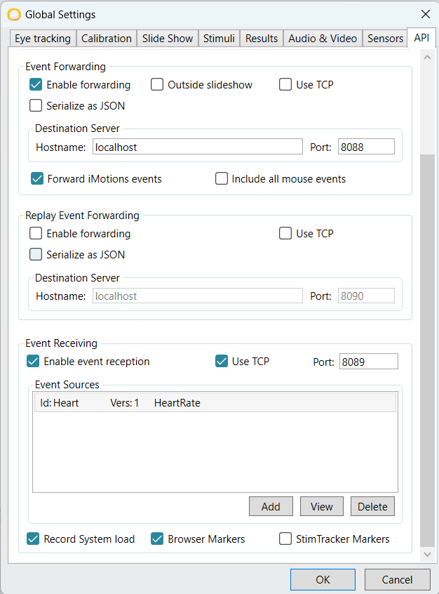

# PolarH10 Middleware for iMotions

Welcome to iMotions_polarH10_connect, a Python middleware designed to seamlessly integrate the Polar H10 Heart rate sensor with iMotions via TCP protocol.

To get started, follow these simple steps:

1. **Clone the Repository:** Begin by cloning this repository to your local machine.
```console
git clone https://github.com/danish123117/iMotions_polarH10_connect.git

```  
* If using thonny, simply download the python file named Polar_H10_connect.py
 also download the file config.xml

2. **Install necessary libraries:** Navigate to the cloned repository and install the required libraries.
```console  
cd "iMotions_polarH10_connect"
pip install -r requirements.txt
```
* If using thonny go to tools>manage packages> search bleak and install version 0.22.3
 also search and install openpyxl

3. **Configure iMotions:**
   - Open the iMotions app and navigate to Preferences > Sensor Settings > API.
   - Fill in the required details according to the provided .
   - In Event Sources click 'Add'.
   - Select the `config.xml` file included in this repository and confirm by clicking OK.

4. **Run the Python Code:**
   - Now, execute the Python code provided.
```console
python "Polar_H10_connect.py"
```
   - Choose the appropriate sensor from the list of available sensors.

5. **Enjoy Seamless Integration:**
   - With the setup complete, you're ready to enjoy the seamless connection between the Polar H10 Heart rate sensor and iMotions.


Feel free to reach out if you encounter any issues or have any questions. Happy analyzing!


